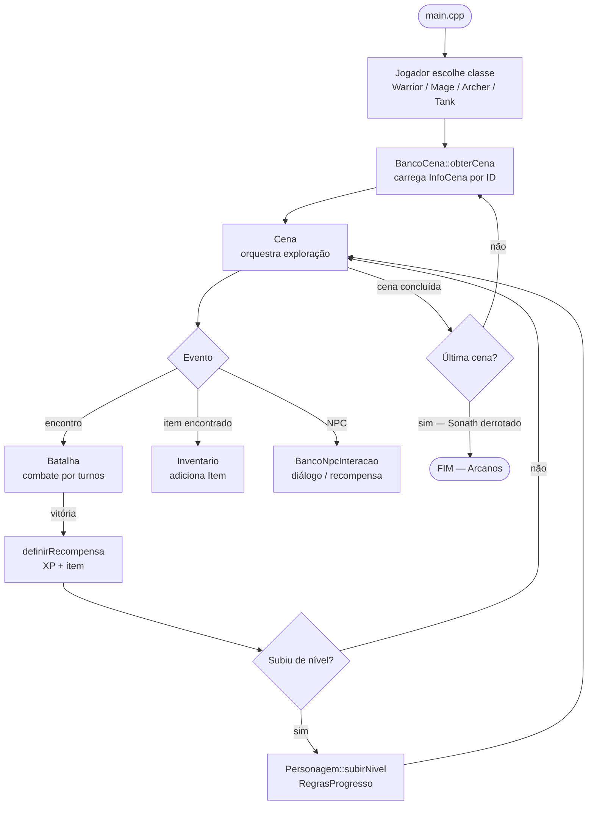
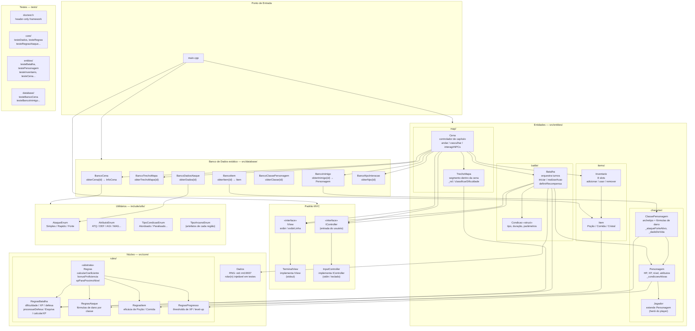
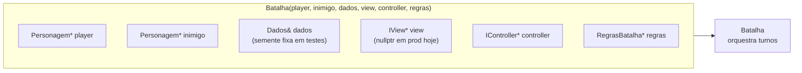
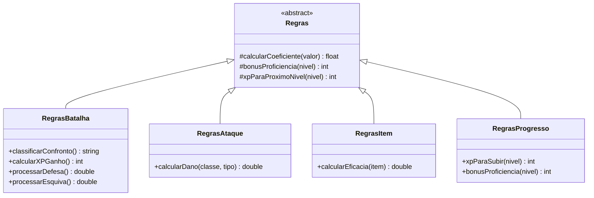

# Arquitetura — The Dark Age: The Arcanum Quest

## Tecnologias e Ferramentas

| Camada | Tecnologia |
|--------|-----------|
| Linguagem | C++17 |
| Compilador | g++ (flags: `-std=c++17 -Wall -Wextra`) |
| Build | GNU Make (Makefile com busca recursiva via `find`) |
| Testes | [doctest](https://github.com/doctest/doctest) (header-only, `tests/doctest.h`) |
| Cobertura | gcovr + `--coverage` do g++ → HTML em `docs/coverage/` |
| Documentação | Doxygen (`Doxyfile`) |
| RNG | `std::mt19937` encapsulado em `Dados` (injetável via semente para testes) |

---

## Fluxo de Execução (Game Loop)



---

## Organização de Camadas e Classes



---

## Injeção de Dependência em Batalha



---

## Hierarquia de Regras



---

## Estrutura de Diretórios

```
PDS2-2026-PF-grupo5/
├── include/                   # Contratos (.hpp)
│   ├── controllers/           # InputController.hpp
│   ├── core/
│   │   ├── Dados.hpp
│   │   └── rules/             # Regras*.hpp
│   ├── database/              # Banco*.hpp + Struct*.hpp
│   ├── demo/                  # Demo.hpp, Exploracao.hpp
│   ├── entities/
│   │   ├── battle/            # Batalha.hpp, Condicao.hpp
│   │   ├── character/         # ClassePersonagem.hpp, Personagem.hpp, Jogador.hpp
│   │   ├── items/             # Item.hpp, Inventario.hpp
│   │   └── map/               # Cena.hpp, TrechoMapa.hpp
│   ├── utils/                 # Enums + IView.hpp + IController.hpp
│   └── views/                 # TerminalView.hpp
├── src/                       # Implementações (.cpp) — espelha include/
├── tests/                     # Testes doctest — espelha src/
│   ├── doctest.h
│   ├── main.cpp               # DOCTEST_CONFIG_IMPLEMENT_WITH_MAIN
│   ├── core/
│   ├── database/
│   ├── entities/
│   ├── controllers/
│   └── views/
├── design/                    # Cartões CRC + User Stories
├── docs/                      # Doxygen + regras.md + cobertura HTML
├── Makefile
└── Doxyfile
```
